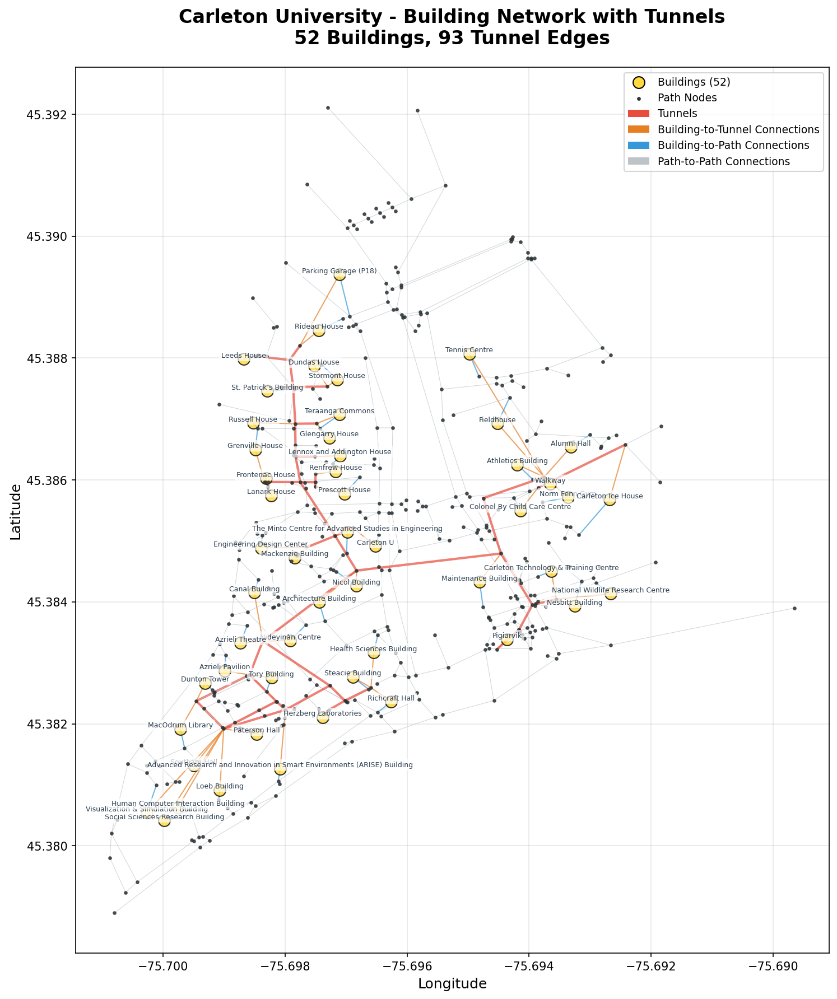
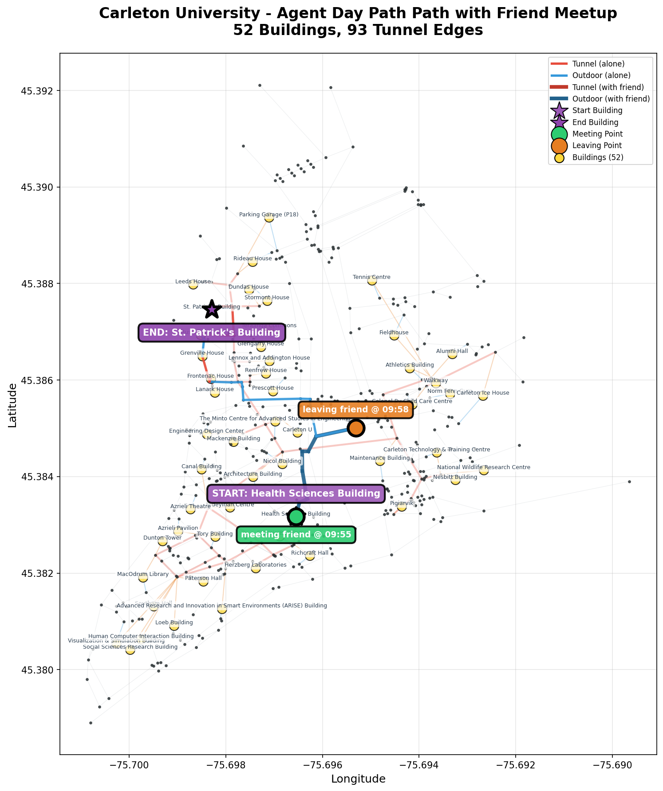
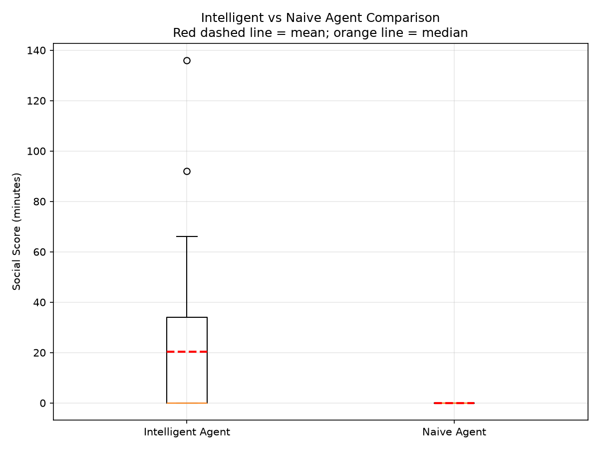

# Carleton Multi-Agent Pathfinding

A Python simulation that helps two students maximize the amount of time they can spend walking together between classes on Carleton University's campus.

The system models campus routes as a weighted graph, uses A* search to plan paths, applies fuzzy logic to choose between tunnels and outdoor routes based on weather, and evaluates whether an intelligent rendezvous strategy outperforms a naive direct-walk baseline.

## Highlights

- **Campus graph modeling:** builds a pedestrian network from OpenStreetMap data and connects named buildings to nearby outdoor paths and tunnel nodes.
- **A-star pathfinding:** computes shortest routes across outdoor, tunnel-only, or unrestricted path options.
- **Weather-aware decisions:** uses a fuzzy rule system to decide whether a student is likely to prefer tunnels based on temperature, precipitation, and tunnel detour cost.
- **Multi-agent rendezvous planning:** finds feasible meeting points along a friend's route while ensuring the agent can still reach their next class on time.
- **Simulation + evaluation:** compares an intelligent social-time-maximizing agent against a naive direct-path baseline and analyzes the results with a paired t-test.
- **Visual outputs:** generates campus network maps, route visualizations, comparison box plots, and deviation-vs-improvement charts.

## Demo outputs

### Campus network



### Example agent path



### Intelligent vs naive comparison



## Results snapshot

The checked-in simulation sample contains 49 successful schedule comparisons:

| Metric | Intelligent agent | Naive baseline |
| --- | ---: | ---: |
| Mean social time | 20.27 min | 0.00 min |
| Simulations with improvement | 21 / 49 | — |
| Paired t-test p-value | 0.0000166 | — |

In this sample, the intelligent agent achieved significantly more shared walking time than the naive baseline by deliberately meeting the friend along feasible overlapping route windows.

## How it works

1. **Build the campus graph**
   - Downloads Carleton pedestrian paths with OSMnx.
   - Tags underground tunnel edges separately from outdoor routes.
   - Adds building nodes and connects them to nearby paths/tunnels.

2. **Generate student schedules**
   - Creates pairs of class schedules using named campus buildings.
   - Treats the time between classes as possible travel/social windows.

3. **Plan routes**
   - The friend takes a weather-aware route selected with fuzzy logic.
   - The intelligent agent searches for the earliest reachable point on the friend's path.
   - If meeting is possible, the agent walks with the friend as long as possible while preserving enough travel time to reach their next class.

4. **Compare strategies**
   - Intelligent strategy: intentionally detours when it increases feasible shared time.
   - Naive baseline: follows direct paths and only counts incidental overlap.

5. **Analyze outcomes**
   - Aggregates social time across generated schedules.
   - Runs descriptive statistics and a paired t-test.
   - Produces plots under `results/`.

## Tech stack

- Python
- OSMnx
- NetworkX
- pandas / NumPy
- SciPy
- Matplotlib
- scikit-fuzzy

## Setup

```bash
python3 -m venv venv
source venv/bin/activate
pip install -r requirements.txt
```

## Run the project

Run the full comparison pipeline:

```bash
python main.py
```

Run a smaller/faster comparison:

```bash
python main.py --num-schedules 10 --num-visualizations 1
```

Generate a visual demo from the checked-in schedules:

```bash
python main.py --demo
```

Generate comparison data only:

```bash
python compare_results.py
# or
python main.py --skip-analysis
```

Run statistical analysis on the generated CSV:

```bash
python statistical_analysis.py
```

## Project structure

```text
.
├── astar.py                    # A* pathfinding with tunnel/outdoor constraints
├── graph.py                    # OSMnx campus graph construction
├── fuzzy_decision.py           # Weather and detour fuzzy logic
├── multi_agent_pathfinding.py  # Rendezvous planning and social-time scoring
├── schedule_generator.py       # Synthetic schedule pair generation
├── compare_results.py          # Intelligent-vs-naive simulation runner
├── statistical_analysis.py     # Summary stats, t-test, and plots
├── visualization.py            # Network/path visualization helpers
├── schedules/                  # Demo and generated schedule JSON files
└── results/                    # CSV outputs and generated plots
```

## My role

Solo implementation for a COMP3106 artificial intelligence project. I designed and implemented the graph construction, A* pathfinding integration, fuzzy route-preference system, multi-agent rendezvous logic, simulations, and statistical evaluation.

## Future improvements

- Cache downloaded OSM data to make repeated runs faster and fully reproducible.
- Add CLI controls for fixed weather scenarios and random seeds.
- Support real timetable imports instead of generated schedules.
- Expand the objective function to balance social time, lateness risk, walking distance, accessibility, and weather exposure.
